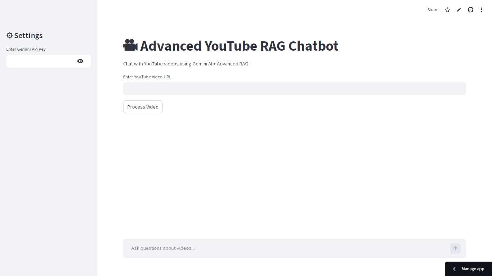
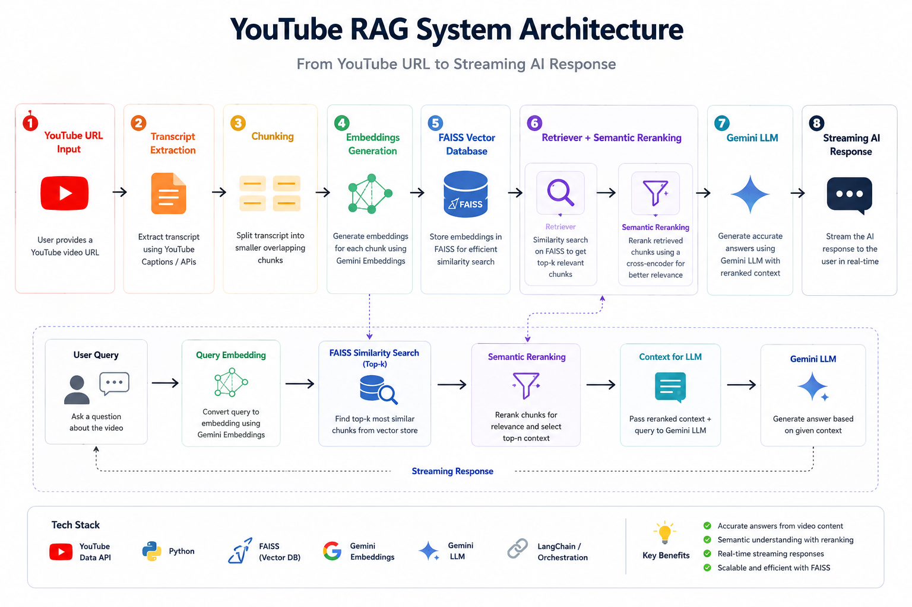
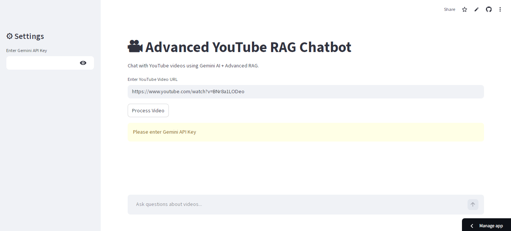
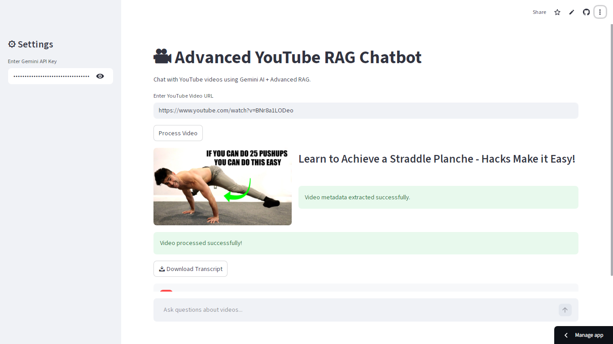
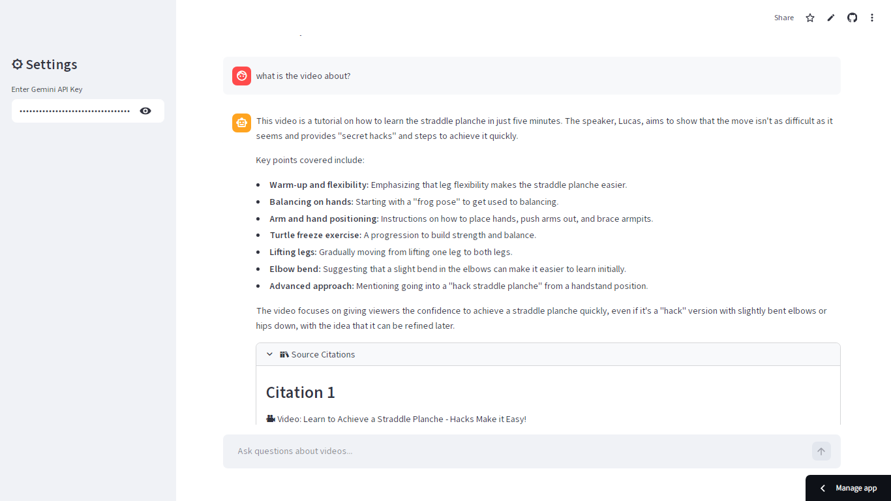

# 🎥 Advanced YouTube RAG Chatbot


---

Deployed App Link:
https://chatwithvideos.streamlit.app/

---

# 📌 Project Overview

This application allows users to interact conversationally with YouTube videos.

The system extracts video transcripts, converts them into semantic embeddings, stores them in a FAISS vector database, retrieves relevant transcript chunks, reranks results semantically, and generates contextual answers using Gemini AI.

The project demonstrates:
- RAG pipeline engineering
- NLP workflows
- conversational memory
- semantic retrieval
- vector databases
- production AI application architecture

---



---

# 🚀 Live Features

✅ YouTube transcript extraction  
✅ Conversational AI chatbot  
✅ Multi-video support  
✅ Semantic search with FAISS  
✅ Gemini-powered responses  
✅ Semantic reranking  
✅ Timestamp citations  
✅ Transcript download  
✅ Streaming responses  
✅ Video thumbnail preview  
✅ Persistent vector database  
✅ Production-style modular architecture  

---

## System Architecture

 


---

# ⚙️ Tech Stack

## Frontend
- Streamlit

## AI / NLP
- LangChain
- Google Gemini AI
- Sentence Transformers

## Vector Database
- FAISS

## Data Processing
- YouTube Transcript API
- Recursive Text Chunking

---

# 📂 Project Structure

```text
youtube-rag-chatbot/
│
├── app.py
├── requirements.txt
├── README.md
├── .gitignore
├── .env
│
├── utils/
│   ├── transcript.py
│   ├── chunking.py
│   ├── embeddings.py
│   ├── vectorstore.py
│   ├── rag_chain.py
│   ├── reranker.py
│
├── data/
│   └── faiss_index/
│
└── images/
    └── screenshots/
```

---

# 🚀 Installation

## Clone Repository

```bash
git clone github.com/maw-khan/youtube-rag-chatbot.git
```

## Install Dependencies

```bash
pip install -r requirements.txt
```

## Run Application

```bash
streamlit run app.py
```

---

🔑 API Key Setup
You need a Google Gemini API Key.
Get it from:
👉 https://ai.google.dev/
No need for .env file — the app accepts it directly via Streamlit sidebar.



---

▶️ Run the Deployed App (Link):

https://chatwithvideos.streamlit.app/

---

## 💡 How to Use
1. Enter your Gemini API Key in the sidebar
2. Paste youtube videos links/URL
3. Click “Process Video”
4. Wait for processing to complete
5. Start asking questions in the chat box
6. View answers + expandable source references

📚 Example Query
“What is the main conclusion of the video?”
The chatbot will:
- Retrieve relevant chunks
- Generate an answer using Gemini
- Show source excerpts used for reasoning
  


---



---

# 🔥 Key Features Explained

## 🎥 Transcript Extraction
Automatically extracts transcripts from YouTube videos.

## 📊 Retrieval-Augmented Generation (RAG)
Relevant transcript chunks are retrieved before generating responses.

## 📚 Semantic Reranking
Retrieved chunks are reranked using transformer-based semantic similarity models.

## 📌 Timestamp Citations
Responses include transcript timestamps for source verification.

## ⚡ Streaming Responses
Answers stream in real time for better conversational UX.

## 📥 Transcript Download
Users can download processed transcripts directly.

---

# 🚀 Future Improvements

- YouTube playlist support
- Multi-user authentication
- Chat export
- PDF summary generation
- Voice interaction
- Hybrid BM25 + vector retrieval
- LangGraph agent workflows

---

# 📌 Learning Outcomes

This project helped strengthen understanding of:
- AI application engineering
- RAG pipelines
- vector search systems
- semantic retrieval
- conversational memory
- Streamlit deployment
- modular software architecture

---

# 👨‍💻 Author

Muhammad Ali Waris Khan

AI Developer | RAG Systems | Streamlit AI Apps | Python
